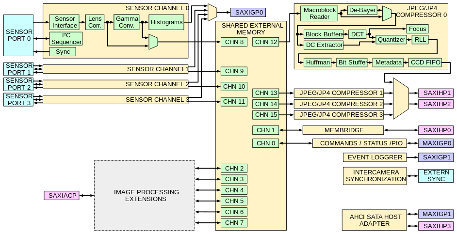

x393
=====

FPGA code for Elphel 393 camera, created with [VDT plugin](https://github.com/Elphel/vdt-plugin). It runs on Xilinx Zynq 7030 SoC (FPGA plus dual ARM).

[Documentation](http://docs.elphel.com/x393) is generated with Doxygen-based Doxverilog.

Run ./INIT_PROJECT in the top directory to copy initial .project and .pydevproject files for Eclipse
